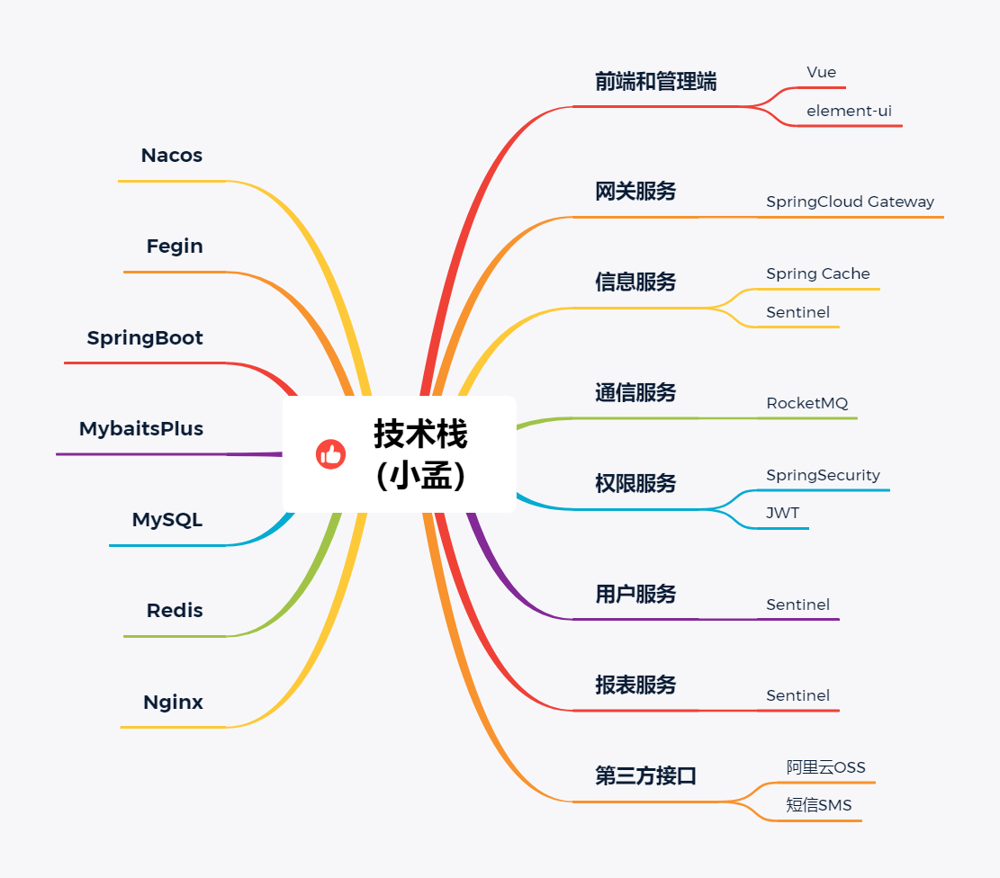

# 一，会员系统

#### 介绍
🔥🔥🔥本项目完全开源，采用的技术是SpringBoot+Vue+Mysql+Mybatis，项目非常的nice，带详细的部署教程，主要是会员相关方面的管理、积分管理等。可以用于学习或者二次开发，感谢提出宝贵的建议，技术交流微：fly996868

#### 软件架构

采用的技术栈：SpringBoot+Vue+Mysql+Mybatis，具体的如下所示





#### 项目演示


#### 项目展开讲解


####  1.1会员界面

整个网站，用户通过登录进入会员界面，填写信息进入主页面即可对用户信息进行管理。修改后的用户信息会同步在数据库里面，确保数据不会丢失。


# 二、后端搭建

## 2.1 创建项目

打开idea创建一个项目，在new一个项目的时候选择Spring Initializr，在选择项目依赖的时候勾选Web下的Spring Web Starter 和SQL下的MySQL Driver和MyBatis Framework，然后一直继续后会得到如下结构，总体分为四层。


## 2.2 配置文件

### 2.2.1 数据库资源配置

创建application-dev.yml文件用于配置数据库资源，连接数据库。


‍

### 2.2.2 项目参数和选项配置

创建application.yml文件用于设置项目的各种参数和选项。

1. 服务器端口配置：

    ```
    server:
      port: 8081
    ```

    指定了服务器的端口号为8081。
2. 多环境配置：

    ```
    spring:
      profiles:
        active: dev
    ```

    设置了Spring框架的当前活动环境为dev（开发环境）。
3. 连接池配置：

    ```
    datasource:
      druid:
        initial-size: 5
        min-idle: 5
        max-active: 20
        max-wait: 30000
        time-between-eviction-runs-millis: 60000
        min-evictable-idle-time-millis: 300000
        test-while-idle: true
        test-on-borrow: true
        test-on-return: false
        remove-abandoned: true
        remove-abandoned-timeout: 1800
        filters: stat, wall
        validation-query: SELECT 'x'
    ```

    配置了连接池的各种参数，如初始连接数、最小空闲连接数、最大活动连接数等。同时还设置了连接池的一些测试属性，比如在闲置时是否进行连接检测、在借用时是否进行连接检测等。
4. JSON时间格式设置：

    ```
    jackson:
      time-zone: GMT+8
      date-format: yyyy-MM-dd HH:mm:ss
    ```

    指定了使用Jackson库进行JSON序列化和反序列化时的时间格式，统一使用GMT+8时区，并且日期格式为yyyy-MM-dd HH:mm:ss。
5. 设置上传文件大小限制：

    ```
    servlet:
      multipart:
        max-file-size: 100MB
        max-request-size: 100MB
    ```

    设置了上传文件的最大大小限制为100MB。
6. 邮件服务器配置：

    ```
    mail:
      host: smtp.qq.com
      username:
      password:
      default-encoding: UTF-8
      properties:
        mail:
          smtp:
            auth: true
            socketFactory:
              class: javax.net.ssl.SSLSocketFactory
              port: 465
    ```

    配置了邮件服务器的相关信息，包括SMTP主机地址、用户名、密码等。同时还指定了使用SSL加密连接，并设置了相应的端口。
7. Mybatis-plus配置：

    ```
    mybatis-plus:
      mapper-locations: classpath*:com/eleadmin/**/*Mapper.xml
      configuration:
        map-underscore-to-camel-case: true
        cache-enabled: true
      global-config:
        :banner: false
        db-config:
          id-type: auto
          logic-delete-value: 1
          logic-not-delete-value: 0
    ```

    配置了Mybatis-plus框架的一些选项。其中`mapper-locations`​指定了Mapper文件的位置，`map-underscore-to-camel-case`​将数据库表字段命名转换为驼峰命名规则，`cache-enabled`​表示启用缓存。`global-config`​部分配置全局选项，比如关闭控制台打印SQL语句的banner，设置数据库的一些默认值。
8. 框架配置：

    ```
    config:
      open-office-home: C:/OpenOffice4/
      swagger-base-package: com.eleadmin
      swagger-title: EleAdmin API文档
      swagger-version: 1.0
      token-key: ULgNsWJ8rPjRtnjzX/Gv2RGS80Ksnm/ZaLpvIL+NrBg=
    ```

    配置了一些框架相关的选项。其中`open-office-home`​指定了OpenOffice的安装路径，`swagger-base-package`​指定了Swagger接口文档扫描的基础包，`swagger-title`​和`swagger-version`​分别设置了生成的Swagger文档的标题和版本号。`token-key`​则是用于身份验证的密钥。

### 2.2.3 pom.xml

**pom.xml** 文件负责配置项目相关的依赖和插件，包括上面的 MyBatis Generator（项目plugins 标签中注视掉的代码是对 Mybatis-generator 插件的配置），在创建项目时，idea 已经帮我们引入了一些依赖，下面我们需要在 dependencies 标签中引入项目需要的一些依赖，配置的代码可以直接看代码，这里就不往出写了，下面对主要依赖进行下描述：

|package|说明|
| -----------------------------| --------------------------------------|
|mybatis-spring-boot-starter|MyBatis核心for Spring Boot|
|mysql-connector-java|java 与 mysql 连接的 jar 包驱动程序|
|fastjson|实现 json 对象与 JavaBean 对象的转换|

在 plugins 标签中对 Mybatis-generator 进行配置，用于自动生成代码。

至此，项目的配置就弄完了，在命令行执行 `./mvnw mybatis-generator:generate`​ 自动生成代码，得到的项目结构如下所示。生成项目后，需要将上面 **pom.xml** 文件中 Mybatis-generator 插件的配置注视调，因为这个文件就是初始时候自动生成代码用的，如果不注视每次运行都会再生成一次，即覆盖之前的代码。


### 2.2.4配置node

下载地址：[Node.js](https://nodejs.org/en/ "Node.js")

根据指引安装node，在cmd窗口中然后依次输入**node -v**和**npm -v**进行查看安装的版本号，通过**npm config get registry**可检查配置是否成功。

# 三、会员客户端项目构建

## 3.1　创建项目

这里项目的创建比后端要简单的多，直接用官方提供的脚手架，运行如下命令先全局安装 vue，然后进行安装。

```
npm install -g @vue/cli

# 进要创建项目的地方
vue create music-client
```

vue 在帮我们创建项目的时候依赖包也会装好，装好后进入项目，执行如下命令项目就跑起来了。

```
npm run serve
```


### 3.2　开发思路

因为代码都放在一起对后期维护和修改都不方便，所以要根据功能把他们拆分到不同目录。

在 pages 目录下放一些视图，里面的每一个组件主要是对整个试图的控制，具体里面的实现可以根据具体情况自己封装组件，或者直接使用第三方组件，components 目录下放置我们封装好的组件，利用 vue-router 把试图都组织起来，加载到 App.vue 文件中，最后渲染到页面中。

最开始构建页面可以写死，当基本样子搭起来之后就可以去向后端去请求数据，请求数据用到的是`axios`​插件，获取到数据在控制台查看请求的数据，确保数据保存到正确的变量中去（这里如果遇到跨域的问题可以在后端用 CORS 解决）。

随着组件的增多，组件之间的传值就是问题，不可能一些数据一直好几个组件里一直传，我们需要 vuex 插件来对数据进行管理（这里通过 sessionStorage 解决 vuex 刷新数据丢失问题）。

不同的组件有时候会用到相同的方法，当要修改方法时就要改好多地方，所以把它们单独拿出来放到 mixins 文件夹下面，当用到这些方法的时候在对应组件中引入即可。

vue 支持很多的第三方组件，能给我们项目带来很好的交互和显示效果，具体在需要的时候引入就行了，当然了，一些样式和图片也可以放到 assets 文件夹下管理。

‍

# 四、项目运行

　　首先，通过运行"ele-admin-api\src\main\java\com\eleadmin\EleAdminApplication.java"中的EleAdminApplication.java文件，可以查看日志信息，整个日志记录了系统的操作记录，包括用户 ID、模块、描述、URL、请求方法、方法、参数、结果、花费时间、操作系统、设备、浏览器和 IP 地址等信息。


　　其次，通过找到该目录下的"huiyuan-vue\package.json"文件，启动开发环境。


　　运行结果如下。通过点击local后的链接即可进入会员界面。


‍

#### 参与贡献

1.  小孟
2.  不做肥宅


#### 特技

1, 开源不易，整理项目不易，star、fork支持下，可以给我们提出宝贵意见，非常感谢。

2，更多优质项目，我会持续更新，专业开发20年，嘿嘿……

3， 感谢：www.javaclimb.com
